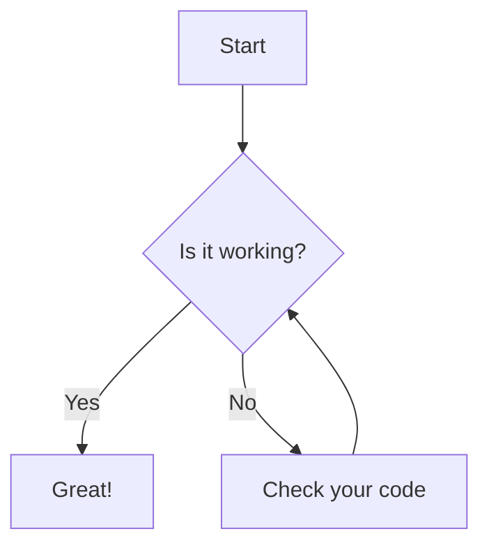

# Mermaid Diagram Maker

A modern, responsive web application for creating and exporting beautiful diagrams using Mermaid syntax. Built with Tailwind CSS for a sleek user interface.


## Features

✨ **Modern UI/UX**
- Clean, responsive design with Tailwind CSS
- Gradient background and card-based layout
- Mobile-first responsive design
- Intuitive two-column layout

🎨 **Diagram Creation**
- Real-time Mermaid diagram rendering
- Syntax highlighting in code editor
- Support for all Mermaid diagram types
- Live preview functionality

📥 **Export Options**
- Download diagrams as high-quality PNG images
- Copy diagrams directly to clipboard
- Scalable vector graphics (SVG) support
- High-resolution export (2x scaling)

📱 **Responsive Design**
- Works seamlessly on desktop, tablet, and mobile
- Touch-friendly interface
- Adaptive layout for different screen sizes

## Demo

The application includes a sample flowchart to get you started:



## Getting Started

### Prerequisites

- A modern web browser (Chrome, Firefox, Safari, Edge)
- Python 3.x (for local development server) or any HTTP server

### Installation

1. **Clone the repository:**
   ```bash
   git clone https://github.com/yourusername/diagram-maker.git
   cd diagram-maker
   ```

2. **Start a local server:**
   ```bash
   # Using Python
   python -m http.server 8000
   
   # Or using Node.js
   npx serve .
   
   # Or using PHP
   php -S localhost:8000
   ```

3. **Open in browser:**
   Navigate to `http://localhost:8000`

### Usage

1. **Write Mermaid Code:** Enter your diagram code in the left panel
2. **Render Diagram:** Click "Render Diagram" to generate the visual
3. **Export:** Use "Download PNG" or "Copy Image" to save your diagram

## Supported Diagram Types

This tool supports all Mermaid diagram types:

- **Flowcharts** - Process flows and decision trees
- **Sequence Diagrams** - Interaction between different actors
- **Class Diagrams** - Object-oriented design representations
- **State Diagrams** - State transitions and workflows
- **Entity Relationship Diagrams** - Database relationships
- **User Journey** - User experience flows
- **Gantt Charts** - Project timelines
- **Pie Charts** - Data visualization
- **Git Graphs** - Version control workflows

## File Structure

```
diagram-maker/
├── index.html          # Main HTML file with Tailwind CSS
├── script.js           # JavaScript functionality
├── style.css           # Legacy CSS (now replaced by Tailwind)
└── README.md           # This file
```

## Technical Details

### Dependencies

- **Mermaid.js** (v10) - Diagram rendering engine
- **Tailwind CSS** - Utility-first CSS framework
- **Vanilla JavaScript** - No additional frameworks required

### Browser Compatibility

- Chrome 60+
- Firefox 55+
- Safari 12+
- Edge 79+

### Features Implementation

- **Responsive Design:** CSS Grid and Flexbox with Tailwind utilities
- **Image Export:** HTML5 Canvas API for PNG generation
- **Clipboard Support:** Modern Clipboard API for image copying
- **SVG Processing:** XMLSerializer for vector graphics handling

## Customization

### Styling

The application uses Tailwind CSS. To customize:

1. Modify classes in `index.html`
2. Add custom CSS in a `<style>` tag or external file
3. Use Tailwind's configuration for theme customization

### Mermaid Configuration

Edit the Mermaid initialization in `script.js`:

```javascript
mermaid.initialize({
    startOnLoad: false,
    theme: 'default', // 'default', 'dark', 'forest', 'neutral'
    flowchart: { 
        useMaxWidth: true, 
        htmlLabels: true 
    },
    // Add more configuration options
});
```

## Contributing

1. Fork the repository
2. Create a feature branch (`git checkout -b feature/amazing-feature`)
3. Commit your changes (`git commit -m 'Add amazing feature'`)
4. Push to the branch (`git push origin feature/amazing-feature`)
5. Open a Pull Request

## License

This project is licensed under the MIT License - see the [LICENSE](LICENSE) file for details.

## Acknowledgments

- [Mermaid.js](https://mermaid.js.org/) - Powerful diagramming and charting tool
- [Tailwind CSS](https://tailwindcss.com/) - Utility-first CSS framework
- [Heroicons](https://heroicons.com/) - Beautiful hand-crafted SVG icons

## Support

If you find this project helpful, please consider:

- ⭐ Starring the repository
- 🐛 Reporting bugs
- 💡 Suggesting new features
- 🤝 Contributing to the codebase

---

**Built with ❤️ using Mermaid.js and Tailwind CSS**